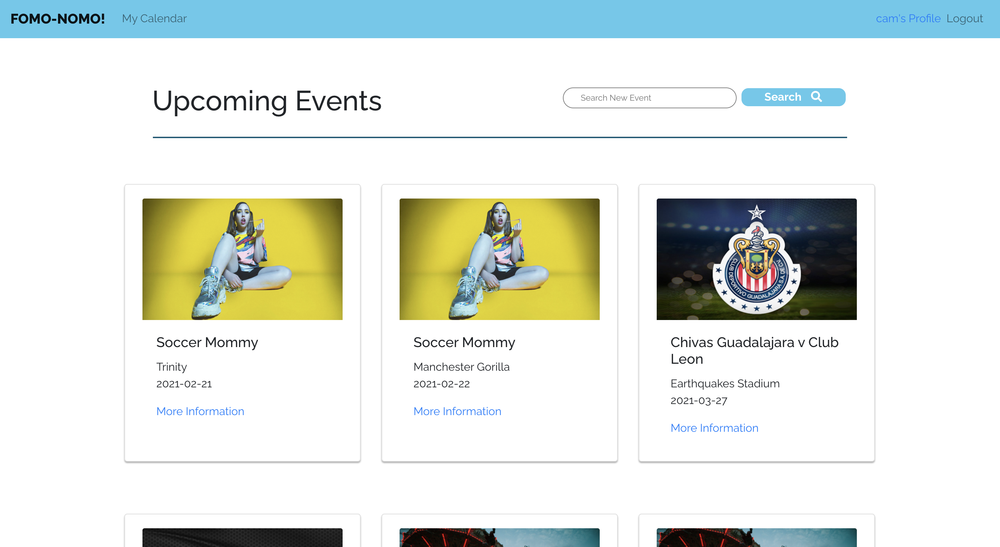

 # FOMO-NOMO! 

 ---

## How to Set Up:
1. Fork & Clone
2. Install dependencies
```
npm i
```
[Link to Deployed App](https://fomo-nomo-frontend.surge.sh) <br>
[Link to Backend Repo](https://github.com/SFX818/Team-5-backend)

---

## Concept:

The FOMO NOMO App is for the user who is bored at home and is looking for new virtual events to avoid the FOMO. Users can add events to their personal calendar or coordinate attending events with their friends.


## Technologies Used:

* Node / Express
* CSS
* Bootstrap
* FontAwesome
* Axios
* React.js
* [Ticketmaster API](https://developer.ticketmaster.com/products-and-docs/apis/getting-started/)


## Approach:

### App Components

* Home Page
* User Auth Pages (Login/Sign Up) ✅
* Event Search
* Searched Event Population Page
* Event Detail Pages
* My Events Show Page (My Calendar)

### ERD:


### Original Wireframes:
Home Page:

Event Page: 

Calendar Page: 

### Color Pallete:

```
#5BC8EC
#FFFFFF
#2C5A65
#C6E4EA
#05607E
#f7f7f7
```

### User Stories:
1. User will land on a homepage and be directed to login / sign-up when any links are clicked
   * Create redirect to login page
   * Verify if user exists or if new sign up is needed (authentication)
   * Add user to user model
1. User is directed to home page after login
    * Create redirect to home page
1. User is able to view pre-populated events or search for new events in their area
    * Set up API connection to pull from Ticketmasters's API's events
    * Pull in all event details through API
    * Redirect to event detail page when selected
1. User is able to add an event to their calendar
    * Confirm addition by navigating to 'My Calendar' page with all favorited events
    * CREATE route to add event in event model
1. User is able to write a review/comment on an event
    * PUT route to add comment to an event
    


### Routes:

| Route | HTTP Verb | CRUD | Model | Explanation			
| ------------- | ------------- | ------------- | ------------- | ------------- |			
| `"/" or "/home"` ✅| GET | READ | N/A | Renders home page			
|`"/register"`✅ | POST | CREATE | `user` | Renders form for new user to sign up			
|`"/login"` ✅| POST | CREATE | `user` | Renders form for user to login			
|`"/calendar"` ✅| GET | READ | `user` & `event` | Displays user's saved calendar
|`"/calendar"` ✅| DELETE | DELETE | `user` & `event` | Delete's event from user's saved calendar			
|`"/profile"` ✅| GET | READ | `user` | Get's user's profile information	
|`"events/:id"` ✅| GET | READ | `event` | Renders all event details for selected API event	
|`"events/:id"` ✅| POST | CREATE | `user` & `event` | Saves event to user's calendar
|`"/event/comments/:id"` ✅| GET | READ |`event` & `comment`| Renders saved event's data and comments
|`"/event/comments/:id"` ✅| POST | CREATE |`event` & `comment`| Adds comment to event and saves to comment database
|`"/event/comments/:id"` ✅| DELETE | DELETE |`event` & `comment`| Deletes comment from event and deletes from comment database	
|`"/event/updatedcomment/:id"` ✅| PUT | UPDATE |`event` & `comment`| Updates comments within event

		
<br/>
<br/>

---

---

<br/>
<br/>

		
### MVP:
- Signup and login  ✅
- Search for events (location, performer, venue, etc)  ✅
- View searched event data ✅
- Add events to their user calendar  ✅
- Delete events from their calendar  ✅
- View saved event data ✅
- Add comments to events  ✅
- Delete comments to events ✅
- Update comments on events ✅


### Stretch Goals:
- User can add a photo to their profile using cloudinary
- User should be able to recommend events to other users 
- User should be able to give a star rating
- User can view events in calendar view


## Challenges:
- Adding events to user's calendar
- Saving frontend API data to backend
- Associating comment to user and event
